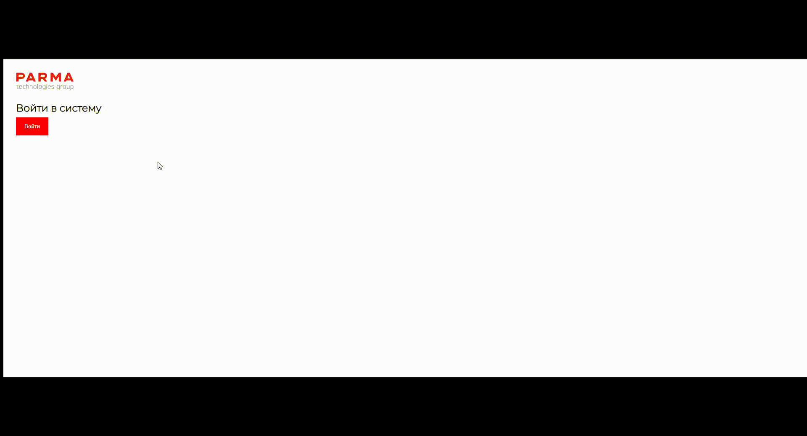
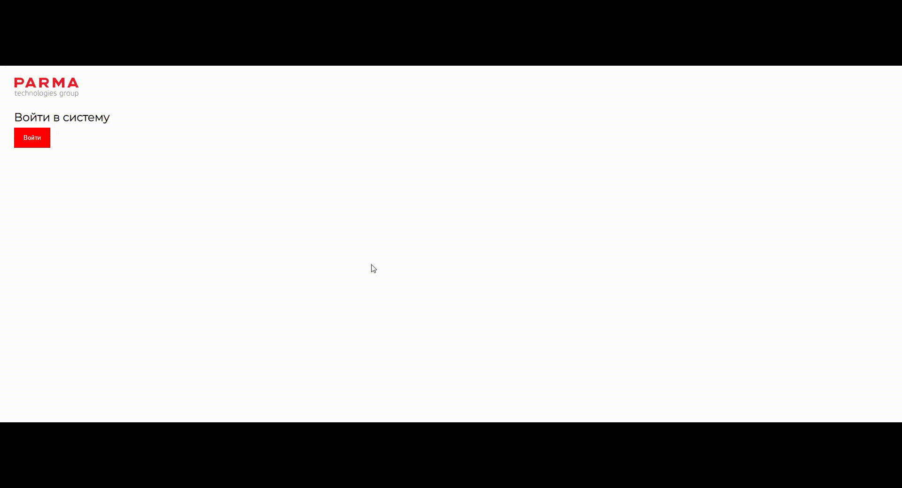

# Кафетерий льгот
Проект разработан командой из 4-х студентов в рамках учебной практики для компании "PARMA Technologies Group". **Я занимался преимущественно разработкой серверной части веб-приложения**.

## Содержание
- [Технологии](#технологии)
- [Описание](#описание)
- [Назначение](#назначение)
- [Функционал](#функционал)
- [Демонстрация функционала](#демонстрация-функционала)
- [ER - диаграмма](#er---диаграмма)
- [TODO](#todo)
- [Ссылки](#ссылки)

## Технологии
- [PHP](https://www.php.net/)
- [JavaScript](https://en.wikipedia.org/wiki/JavaScript)
- [MySQL](https://www.mysql.com/)
- [AMPPS](https://ampps.com/)
- [Figma](https://www.figma.com/)

## Описание
Кафетерий льгот — это список бонусов, из которого сотрудник компании может приобрести за внутреннюю валюту те, которые ему интересны. Бонусы — это льготы и вознаграждения, улучшающие жизнь и здоровье сотрудников компании. Это медицина, страхование, спорт, фитнес, путевки в санатории, обучение, сертификаты и прочее.

## Назначение
Система предназначена для удбного поощрения сотрудников компании.

## Функционал

### Роли пользователей
- HR-компании – полный доступ к ресурсу
- Сотрудник – доступ к обмену валюты на льготы

### Необходимые функциональные возможности системы сотрудника
- Просмотр каталога льгот 
  - Список
  - Стоимость
  - Краткое описание
- Действия с льготами
  - Добавить в корзину из каталога
  - Добавить в список желаний из каталога
  - Добавить в корзину из списка желаний
  - Удалить из корзины/списка желани
  - Выкупить товары из корзины
  - Просмотр купленых льгот

### Необходимые функциональные возможности системы HR
- Добавление/изменение кафетерия
- Управление списком сотрудников (удаление/добавление)
- Начисление баллов сотрудникам 
- Реализация конфиденциальности данных (доступ только у сотрудников компании)

## Демонстрация функционала

### Авторизация и просмотр товаров с аккаунта пользователя

Пользователь(**обычный сотрудник компании**) после авторизации может только просматривать/покупать льготы. Нет возможности редактировать льготы и их категории, нет возможности посмотреть информацию о всех пользователях.

### Авторизация и просмотр товаров с аккаунта HR

HR имеет все возможности обычного пользователя, а также доступ к админ-панеле. Может редактировать/добавлять/удалять льготы и их категории. Может редактировать информацию о сотрудниках, регистрировать новых пользователей.

### Управление льготами с админ панели

Демонстрация возможности редактировать/удалять/добавлять новые льготы и их категории.

### Управление сотрудниками через админ панель

Демонтрация возможностей HR для работы с сотрудниками. Возможность редактирования данных пользователей. Регистрация нового сотрудника. Отдельная кнопка для быстрого увеличения баланса.

### Добавление в корзину/избранное, выкуп товаров из корзины

Демонстрация функционала по добавлению/удалению товаров в избранное/корзину. Выкуп корзины. Данный функционал есть у всех сотрудников, включая HR. 

## ER - диаграмма

## TODO
- [x] Добавить README
- [ ] Выгрузка статистики
- [ ] История покупок
- [ ] Загрузка документов

## Ссылки
- [Дизайн проекта](https://www.figma.com/file/epmpmbcwEsMXMu9ASOqmSv/%D0%9F%D0%B0%D1%80%D0%BC%D0%B0?type=design&node-id=0-1&mode=design)
- [Бизнес-логика](https://miro.com/app/board/uXjVMH-36a4=/)
